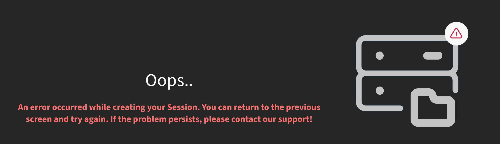

# Launching Dectris Cloud session

Launch it from the `Ubuntu 24.04 Utilities v2` environment. **Select 64GB for software storage**.

It is okay if it says an error happened while launching the session. 
Just go to Analysis -> My Sessions, you'll see the session is actually running.


# Setting up environment and installing packages

## Installing uv

We use `uv` to install and manage the environment. First, install `uv`:
```
curl -LsSf https://astral.sh/uv/install.sh | sh
source ~/.local/bin/env
```

## Installing Ptychodus

We now install Ptychodus as a uv tool. A uv tool is installed in a global environment. You can't import packages directly from that environment, but you can run executables in that environment as commandline tools.
```
uv tool install ptychodus[globus,gui,ptychi] --reinstall-package torch  # Works for CUDA 13.0

mkdir -p $HOME/local/xcb-xinerama
apt-get download libxcb-xinerama0
dpkg-deb -x libxcb-xinerama0_*.deb $HOME/local/xcb-xinerama
export LD_LIBRARY_PATH="$HOME/local/xcb-xinerama/usr/lib/x86_64-linux-gnu:${LD_LIBRARY_PATH:-}"
```
The lines after `uv tool install` install the missing libraries needed by Ptychodus' GUI.

## Downloading the project workspace

The data and scripts we will use in this workshop are on a GitHub repository. Large data files are managed by Git LFS. First download and install Git LFS:
```
cd ~/Downloads
wget https://github.com/git-lfs/git-lfs/releases/download/v3.7.1/git-lfs-linux-amd64-v3.7.1.tar.gz
tar xvzf git-lfs-linux-amd64-v3.7.1.tar.gz
cd git-lfs-3.7.1
./install.sh --local
git lfs install
```

Now clone the project repository:
```
cd /dectris_cloud
git clone https://github.com/mdw771/2026_coherence_ptycho_workshop.git
```

Finally, run `uv sync` in the project root.
```
cd 2026_coherence_ptycho_workshop
uv sync
```
uv would create a Python environment under this directory, download the packages from PyPI based on the versions and builds of the dependencies frozen in `uv.lock`, including Pty-Chi.

> Although we have also downloaded Pty-Chi as a dependency of Ptychodus when we installed Ptychodus as a uv tool, we can't use it directly as it's in the tool environment. In order for us to later use Pty-Chi directly, we install another copy of Pty-Chi in the project environment with `uv sync`. 